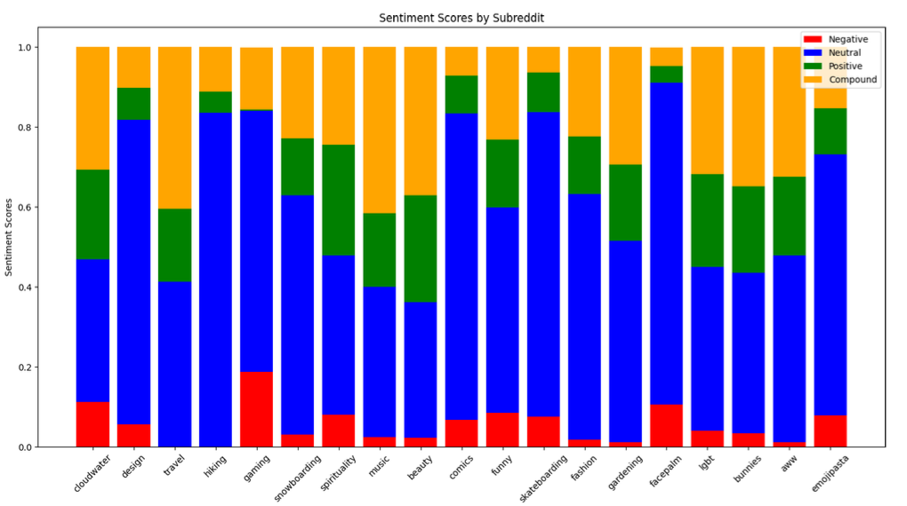

# RedditEmoticonAnalysis
This repository contains the code and data used for analyzing the usage patterns of emoticons in one of the popular social media platforms, Reddit. The aim of this research is to study the impact and effect of emoticons and emojis used in sentences of posts on Reddit

## Implementation
The collected data was pruned and pre-processed to remove problematic content, such as special symbols and content that couldn't be displayed. Three different graphs were created: 
- Bar chart Subreddit Emoji Frequency
- Bar chart Average Sentiment Scores by Subreddit
- Heat Maps Average Sentiment Scores for each Emoji

The above graph shows an overview of how many emojis each subreddit contains, and helps identify where most of the emojis come from. 

Table above the most frequent emojis used for each subreddit, along with a count of the specific emoji used. 

Table above the least frequent emojis used for each subreddit.

The second above graph compares the subreddits with each other, while the third graph gives a more detailed insight into each emoji and its associated sentiment. We observe that the majority sentiment is neutral, which is an interesting result.

Below Graphs show the Positive, Neutral, Negative, and Compound Sentiment for each Emoji.

### Positive Sentiment for each Emoji

### Neutral Sentiment for each Emoji

### Negative Sentiment for each Emoji

### Compound Sentiment for each Emoji

## Conclusion
This study has paved the way for future studies to perform more in-depth analyses of specific subreddits and the way they express themselves through the use of emojis. While there are some patterns and trends that emerge, there is also a great deal of variability and complexity in how these emojis are used, suggesting the need for a more nuanced and context-specific approach to analyzing and understanding language use in online communities. 

## How to Use

 - Install Requirements.txt file by using the below command

`pip install -r requirements.txt`

- Run main.py file to flairs.py file to see the output stored in titles_and_emojis.json file
